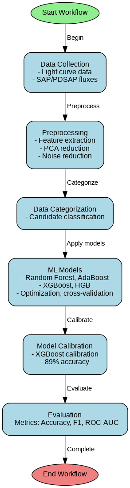
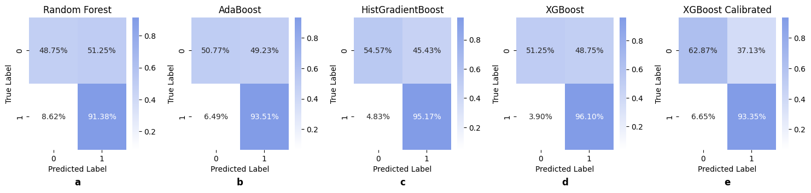

## Exoplanet Detection ML: Detection of Exoplanets with Machine Learning Techniques through Transit Light Curve Analysis
*This project is ongoing and subject to continuous advancements and modifications.*

   

**Exoplanet Detection ML** is a machine learning project dedicated to the detection of exoplanets using transit survey-based light curves. By leveraging advanced machine learning algorithms and feature engineering techniques, this project aims to enhance the accuracy and efficiency of exoplanet discovery.

## Table of Contents

- [Features](#features)
- [Machine Learning Algorithms](#machine-learning-algorithms)
- [Key Notebooks](#key-notebooks)
- [Examples](#examples)
  - [Model Performance](#model-performance)
  - [Light Curve Visualization](#light-curve-visualization)
  - [Workflow](#workflow)
- [Project Structure](#project-structure)
- [Resources](#resources)
  - [Dimensionality Reduction](#dimensionality-reduction)
  - [Feature Selection](#tsfresh-feature-selection)
  - [Supervised Learning](#scikit-learn-supervised-learning-list-and-description)
  - [Gaussian Process](#gaussian-process)
  - [Unsupervised Learning](#scikit-learn-unsupervised-learning-list-and-description)
  - [Hyperparameter Tuning](#hyperopt-hyperparameter-tuning)
  - [Incremental PCA](#incremental-principal-component-analysis)
  - [Plotting](#scikit-learn-plotting)
  - [Probability Calibration](#probability-calibration)
  - [Additional Resources](#technical-problem-solution-and-miscellaneous-links)
- [Acknowledgements](#acknowledgements)
- [License](#license)

## Features

- **Automated Exoplanet Detection**: Utilizes transit survey-based light curves to identify potential exoplanets.
- **Advanced Algorithms**: Implements state-of-the-art machine learning models for high accuracy.
- **Feature Engineering**: Employs robust feature extraction and selection techniques to enhance model performance.
- **Dimensionality Reduction**: Reduces feature space complexity while preserving essential information.

### Light Curve Visualization

 

## Machine Learning Algorithms

Exoplanet ML employs a variety of machine learning algorithms to ensure comprehensive analysis and accurate predictions:

- **Random Forest Classifier**
- **LightGBM**
- **AdaBoost**
- **Histogram Gradient Boosting**
- **XGBoost**
- **XGBoost Calibrated**

## Key Notebooks

- [Kepler Lightcurve Notebook](https://spacetelescope.github.io/notebooks/notebooks/MAST/Kepler/Kepler_Lightcurve/kepler_lightcurve.html)
- [Feature Engineering with TSFresh](notebooks/feature_engineering_tsfresh.ipynb)
- [Model Training and Evaluation](notebooks/model_training_evaluation.ipynb)

---

### Workflow

---

***Below are some examples of model performance:***

### Model Performance

| Machine Learning Models                     | Accuracy | Precision | Sensitivity | F1-Score | ROC-AUC Score |
|---------------------------------------------|----------|-----------|-------------|----------|---------------|
| Random Forest                               | 84%      | 85%       | 84%         | 83%      | 85%           |
| Adaptive Boosting                           | 82%      | 82%       | 82%         | 80%      | 86%           |
| Histogram Gradient Boosting                 | 87%      | 87%       | 87%         | 87%      | 96%           |
| Extreme Gradient Boosting                   | 86%      | 87%       | 86%         | 85%      | 95%           |
| Extreme Gradient Boosting (Calibrated)      | 89%      | 89%       | 89%         | 89%      | 93%           |

### Confusion matrix

## Resources

### Dimensionality Reduction

- [Introduction to PCA, t-SNE, and UMAP](https://www.kaggle.com/code/samuelcortinhas/intro-to-pca-t-sne-umap)
- [Plotly t-SNE and UMAP Projections](https://plotly.com/python/t-sne-and-umap-projections/)
- [Kernel PCA in scikit-learn](https://scikit-learn.org/stable/modules/generated/sklearn.decomposition.KernelPCA.html)
- [Understanding UMAP](https://pair-code.github.io/understanding-umap/)
- [UMAP Documentation](https://umap-learn.readthedocs.io/en/latest/basic_usage.html)

### TsFresh Feature Selection

- [TsFresh API Documentation](https://tsfresh.readthedocs.io/en/latest/api/tsfresh.feature_selection.html)
- [TsFresh for Industrial Applications](https://blog.mindmeldwithminesh.com/tsfresh-feature-extraction-by-distributed-and-parallel-means-for-industrial-big-data-applications-d84e9704702f)

### Scikit-Learn Supervised Learning List and Description

- [Scikit-Learn Supervised Learning](https://scikit-learn.org/stable/supervised_learning.html)

### Gaussian Process

- [Scikit-Learn Gaussian Process](https://scikit-learn.org/stable/modules/gaussian_process.html)
- [Gaussian Process Classifier](https://scikit-learn.org/stable/modules/generated/sklearn.gaussian_process.GaussianProcessClassifier.html)
- [Gaussian Process Kernels](https://scikit-learn.org/stable/modules/gaussian_process.html#gp-kernels)

### Scikit-Learn Unsupervised Learning List and Description

- [Scikit-Learn Unsupervised Learning](https://scikit-learn.org/stable/unsupervised_learning.html)

### Hyperopt Hyperparameter Tuning

- [Hyperopt Getting Started](http://hyperopt.github.io/hyperopt/getting-started/search_spaces/)
- [Hyperopt Tutorial on Kaggle](https://www.kaggle.com/code/fanvacoolt/tutorial-on-hyperopt/notebook)

### Incremental Principal Component Analysis

- [Principal Component Analysis with Python](https://www.geeksforgeeks.org/principal-component-analysis-with-python/)
- [Incremental PCA in scikit-learn](https://scikit-learn.org/stable/modules/generated/sklearn.decomposition.IncrementalPCA.html)

### Scikit-Learn Plotting

- [Scikit-Learn Display Object Visualization](https://scikit-learn.org/stable/auto_examples/miscellaneous/plot_display_object_visualization.html)
- [Confusion Matrix](https://scikit-learn.org/stable/modules/generated/sklearn.metrics.confusion_matrix.html)

### Probability Calibration

- [Probability Calibration in scikit-learn](https://scikit-learn.org/stable/modules/calibration.html)
- [Calibrated Classifier](https://scikit-learn.org/stable/modules/generated/sklearn.calibration.CalibratedClassifierCV.html)

### Technical Problem Solution and Miscellaneous Links

- [Issue #1280 - YOLOv7](https://github.com/WongKinYiu/yolov7/issues/1280)
- [Scikit Optimize Issues](https://github.com/scikit-optimize/scikit-optimize/issues)

## Acknowledgements

- [Feature Engineering with TSFresh](https://www.rasgoml.com/feature-engineering-tutorials/how-to-create-time-series-features-with-tsfresh)
- [Exoplanet Archive Acknowledgements](https://exoplanetarchive.ipac.caltech.edu/docs/acknowledge.html)
- [Exoplanet Archive DOI](https://exoplanetarchive.ipac.caltech.edu/docs/doi.html)
- [Exoplanet Archive Table View](https://exoplanetarchive.ipac.caltech.edu/cgi-bin/TblView/nph-tblView?app=ExoTbls&config=kep_conf_names)
- [Exoplanet Archive Table Redirect](https://exoplanetarchive.ipac.caltech.edu/docs/table-redirect.html)

## License

This project is licensed under the [MIT License](LICENSE).

---

**Note**: The rest of the code and additional files can be found in the following repositories:

- [Exoplanet ML GitLab](https://gitlab.com/mirsakhawathossain/exoplanet-ml)
- [New Dataset GitLab](https://gitlab.com/mirsakhawathossain/new-dataset)
- [TSFresh Extract GitLab](https://gitlab.com/mirsakhawathossain/tsfresh-extract)
- [Data Extract GitLab](https://gitlab.com/mirsakhawathossain/data-extract)
- [ExoData New GitLab](https://gitlab.com/mirsakhawathossain/exodata-new)
- [ExoData GitLab](https://gitlab.com/mirsakhawathossain/exodata)
- [Exoplanet ML FP GitLab](https://gitlab.com/mirsakhawathossain/exoplanetml-fp)
- [Exoplanet ML Kepler GitLab](https://gitlab.com/mirsakhawathossain/exoplanetml-kepler)

<h2><u>Contact</u></h2>

For any inquiries or feedback, please contact:

**Adrita Khan**  
*[📧 Email](mailto:adrita.khan.official@gmail.com) | [🔗 LinkedIn](https://www.linkedin.com/in/adrita-khan) | [🐦 Twitter](https://x.com/Adrita_)*

